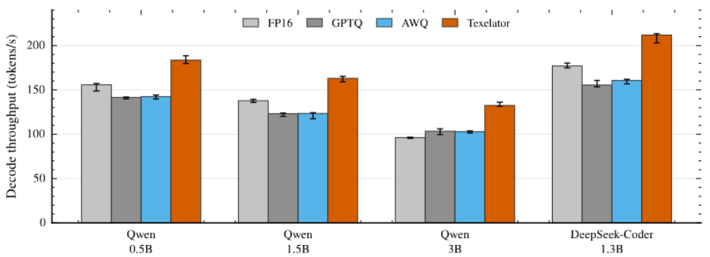

# Texelator

**Low-bit LLM inference through the GPU Texture Unit.** Texelator stores eligible
linear weights as signed BC4 blocks and reconstructs them in fixed-function texture
hardware. It does not change the Transformer architecture.

> **Featured model:** Qwen3.8-27B is supported as a published, text-only
> activation-aware BC4 model on validated RTX 40- and RTX 50-series GPUs.

[Paper (PDF)](research/paper/Texelator.pdf) ·
[Qwen3.8-27B BF16-calibrated model](https://huggingface.co/hp0303/Qwen3.8-27B-Texelator-AWBC4-BF16Cal) ·
[Latest release](https://github.com/hp0303/Texelator/releases/latest)

> **Early alpha — bug reports are very welcome.** Texelator is still experimental,
> and behavior may vary across GPUs, drivers, CUDA versions, and model architectures.
> If something fails or produces unexpected output, please
> [open an issue](https://github.com/hp0303/Texelator/issues) with the full command,
> complete error log, GPU model, driver version, CUDA Toolkit version, OS, and model ID.
> Please do not silently skip a failed setup, benchmark, or correctness stage.



## Install and chat

### Windows 11 (native PowerShell)

Download `texelator-v0.3.0-windows.zip` from the
[latest release](https://github.com/hp0303/Texelator/releases/latest), extract it,
open PowerShell in `texelator_windows`, and run:

```powershell
Set-ExecutionPolicy -Scope Process Bypass
.\setup.ps1
.\texelator.cmd pull qwen3.8:27b
.\texelator.cmd benchmark qwen3.8:27b
.\texelator.cmd run qwen3.8:27b
```

Requirements: Windows 11 x64, an RTX 40/50-series GPU, current NVIDIA driver,
Python 3.10--3.14 x64, Visual Studio 2022 **Desktop development with C++**, and
CUDA Toolkit 12.8. WSL is not required.

### Linux or WSL2

```bash
git clone https://github.com/hp0303/Texelator.git
cd Texelator
bash scripts/install.sh
source .venv/bin/activate
texelator pull qwen3.8:27b
texelator benchmark qwen3.8:27b
texelator run qwen3.8:27b
```

`benchmark` is required once for each model/GPU pair. It correctness-checks and saves
both the decode lookahead and the 32/128/512-token BF16 prefill tile selection locally.
Omit the prompt after `run` to start terminal chat. Thinking is off by default; use
`/thinking on` and `/thinking off` interactively. Texelator imposes no default
output-token limit and stops at EOS or the context limit.

Texelator automatically uses two execution paths: single-token decode keeps the
texture-native GEMV selected by `benchmark`, while BF16 prefill selects among five
correctness-equivalent CUTLASS Texture IteratorB tiles for the current GPU and shape.
This avoids a full dense-weight write and does not keep a second 16-bit copy of the
model. Check both paths on a standalone artifact with:

```bash
texelator prefill-benchmark qwen3.8:27b --tokens 512 \
  --output texelator-prefill-512.json
```

The command first compares the hybrid result against the legacy scalar texture path,
then records wall/GPU prefill throughput and speedup. See
[hybrid prefill](docs/hybrid-prefill.md) for its scope and tuning controls.

An opt-in MLP-only FP4 prefill experiment is also included:

```bash
texelator run qwen3.8:27b --prefill-mode fp4
```

FP4 is **not** the default and is not quality-equivalent to BF16. On the RTX 5080
512-token validation it improved full-model prefill from 1066.1 to 1325.8 tok/s, but
the final hidden state had cosine 0.872 and relative RMS 0.507 versus BF16. Use it only
for performance experiments; normal inference uses `--prefill-mode bf16`.

## What is included

```text
texelator/          Runtime, PTQ encoder, CUDA extension, and CLI
scripts/            Linux installation and model publishing helpers
docs/               Model support and developer documentation
tests/              CPU-safe unit and repository tests
research/
  paper/            Current paper PDF
  results/paper/    Compact public CSVs and the headline figure
  scripts/          Figure reproduction code
setup.ps1           Native Windows installer
texelator.cmd       Native Windows command wrapper
```

Downloaded checkpoints, converted weights, Hugging Face caches, raw traces, and the
internal Q0--Q7 experiment workspaces are intentionally excluded.

## Use a published model

The public model flow is deliberately explicit:

```bash
texelator pull qwen3.8:27b
texelator benchmark qwen3.8:27b
texelator run qwen3.8:27b "Introduce yourself in one sentence."
```

The published Qwen3.8-27B artifact is text-only. The same BC4 payload is shared by
validated RTX 40- and RTX 50-series devices only when their measured hardware palette
hash matches. CUDA kernels and K profiles are built or measured locally for the actual
GPU.

## Convert your own model

Download a floating-point Hugging Face checkpoint:

```bash
texelator model install Qwen/Qwen2.5-3B --name qwen-3b
```

Or register an existing local checkpoint without copying or modifying it:

```bash
texelator model register /models/Qwen2.5-3B --name qwen-3b
```

Run activation-aware, hardware-exact BC4 PTQ and then benchmark it:

```bash
texelator ptq qwen-3b --name qwen-3b-awbc4 --output /models/qwen-3b-awbc4
texelator benchmark qwen-3b-awbc4
texelator run qwen-3b-awbc4
```

PTQ requires the original FP16, BF16, or FP32 checkpoint. Already packed GPTQ, AWQ,
and GGUF files cannot be converted because the encoder needs source-precision weights.
The current general path targets dense causal LMs with ordinary `q_proj`, `k_proj`,
`v_proj`, `o_proj`, `gate_proj`, `up_proj`, and `down_proj` linears whose input
dimension is divisible by 16. MoE routing, arbitrary multimodal/hybrid architectures,
and tensor-parallel conversion are not automatic.

See [QUICKSTART.md](QUICKSTART.md), [local model guidance](docs/local-models.md), and
[supported models](docs/supported-models.md) for details.

## Platform and numerical scope

- Native Windows 11, Linux, and WSL2 are supported from source.
- RTX 4060, RTX 4080 SUPER, and RTX 5080 have been validated.
- RTX 5080 pulls the BF16-source/BF16-calibrated Qwen3.8-27B artifact. RTX 40-series
  currently keeps the earlier FP16 artifact. Both paths accumulate into FP32 registers.
- Current inference targets batch-one CUDA execution.
- BF16 multi-token prefill fuses texture reconstruction with Tensor Core MMA and does
  not materialize a dense weight matrix in global memory.
- GPU-specific hardware reconstruction is measured and protected by a palette hash.

Windows local state defaults to `%LOCALAPPDATA%\Texelator`. Linux/WSL state defaults
to `~/.cache/texelator`. Set `TEXELATOR_HOME` and `HF_HOME` to place data elsewhere.

## Research artifacts

The current manuscript is [research/paper/Texelator.pdf](research/paper/Texelator.pdf).
Compact measurements used by the public figures are under
[research/results/paper](research/results/paper). Regenerate the figures with:

```bash
python -m pip install -e '.[paper]'
python research/scripts/plot_paper_results.py
```

The paper uses an audited native-vLLM evaluation harness. The Transformers CLI in
this repository prioritizes simple local use and is not presented as a bit-for-bit
replacement for every paper benchmark harness.

## License

Texelator is released under the MIT License. Models and datasets retain their own
licenses and are not distributed in this Git repository.
